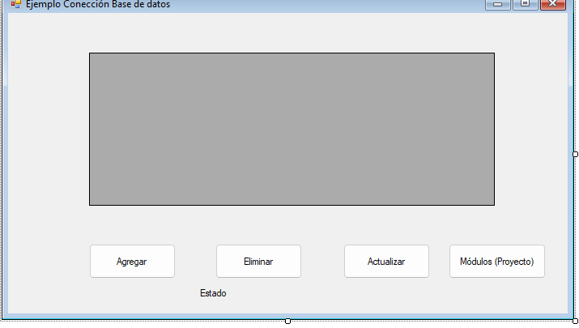

## Curso: Algorítmica y Programación – Instituto Universitario Jesús Obrero
## Herramientas: SharpDevelop 4.4, XAMPP, phpMyAdmin, MySQL Connector/NET 

---

# Guía de Proyecto: Sistema Bilingüe con Base de Datos

Esta guía detalla la implementación de un sistema de gestión bilingüe (Español/Inglés) que servirá como base para el **Proyecto Final**. El sistema permite gestionar usuarios, módulos educativos y sus respectivas preguntas.

---

## 1. Estructura de la Base de Datos (SQL)

Para este proyecto manejamos tres entidades relacionadas. Ejecute el siguiente script en phpMyAdmin:

```sql
CREATE DATABASE IF NOT EXISTS `peducativa` DEFAULT CHARACTER SET utf8mb4 COLLATE utf8mb4_general_ci;
USE `peducativa`;

-- 1. Tabla de Usuarios (Para control de acceso)
CREATE TABLE IF NOT EXISTS `usuario` (
  `id` int(11) NOT NULL AUTO_INCREMENT,
  `nombre` varchar(50) NOT NULL,
  `clave` varchar(50) NOT NULL,
  `rol` int(11) NOT NULL, -- 0: Admin, 1: Jugador
  PRIMARY KEY (`id`)
) ENGINE=InnoDB DEFAULT CHARSET=utf8mb4;

-- 2. Tabla de Módulos (Entidad Bilingüe)
CREATE TABLE IF NOT EXISTS `modulo` (
  `id` int(11) NOT NULL AUTO_INCREMENT,
  `nombre_es` varchar(100) NOT NULL, -- Nombre en Español
  `nombre_en` varchar(100) NOT NULL, -- Nombre en Inglés
  PRIMARY KEY (`id`)
) ENGINE=InnoDB DEFAULT CHARSET=utf8mb4;

-- 3. Tabla de Preguntas (Relacionada con Módulos)
CREATE TABLE IF NOT EXISTS `pregunta` (
  `id` int(11) NOT NULL AUTO_INCREMENT,
  `id_modulo` int(11) NOT NULL, -- Clave Foránea
  `pregunta_es` text NOT NULL,
  `pregunta_en` text NOT NULL,
  `opcion_correcta` varchar(200) NOT NULL,
  PRIMARY KEY (`id`),
  FOREIGN KEY (`id_modulo`) REFERENCES `modulo`(`id`) ON DELETE CASCADE
) ENGINE=InnoDB DEFAULT CHARSET=utf8mb4;

-- Datos de prueba
INSERT INTO `modulo` (id, nombre_es, nombre_en) VALUES 
(1, 'Arquitectura del computador', 'Computer Architecture'),
(2, 'Cálculo', 'Calculus');

INSERT INTO `pregunta` (id_modulo, pregunta_es, pregunta_en, opcion_correcta) VALUES 
(1, '¿Cuál es el cerebro del computador?', 'What is the brain of the computer?', 'CPU'),
(2, '¿Cuál es la derivada de x^2?', 'What is the derivative of x^2?', '2x');
```

---

## 2. Comprensión de las Entidades

### 2.1. Gestión de Usuarios (Referencia)
Se utiliza para entender el CRUD básico. 
*   **Campos:** `id`, `nombre`, `clave`, `rol`.
*   **Lógica:** Es una tabla independiente. Sirve de "plantilla" para los demás módulos.

### 2.2. Gestión de Módulos (Bilingüe)
Es el primer paso hacia la plataforma interactiva.
*   **Campos:** `nombre_es` y `nombre_en`. 
*   **Importancia:** Cada registro representa una categoría de estudio en ambos idiomas.

### 2.3. Gestión de Preguntas (Relación Maestro-Detalle)
Es la entidad más compleja porque depende de un módulo.
*   **Relación:** El campo `id_modulo` indica a qué categoría pertenece la pregunta.
*   **Paso de Datos:** Para ver las preguntas de "Cálculo", el programa debe "pasar" el ID del módulo seleccionado desde la ventana de Módulos a la de Preguntas.

---

## 3. Diseño de Interfaces (UI)

### 3.1. Formulario Principal (`MainForm`)
Contiene la grilla de usuarios y los botones de navegación.
*   **Botón Módulos:** Abre la ventana de gestión bilingüe.

### 3.2. Gestión de Módulos (`GestionModulos`)
| Control | Nombre | Función |
|---------|--------|---------|
| `DataGridView` | `dgvModulos` | Muestra la lista de módulos (ID, ES, EN). |
| `Button` | `btnVerPreguntas` | Abre las preguntas del módulo seleccionado. |

### 3.3. Gestión de Preguntas (`GestionPreguntas`)
| Control | Nombre | Función |
|---------|--------|---------|
| `DataGridView` | `dgvPreguntas` | Muestra las preguntas filtradas por módulo. |

---

## 4. Lógica de Programación y Comunicación

### 4.1. Paso de Parámetros entre Formularios
Para que la ventana de Preguntas sepa qué mostrar, usamos el **Constructor con Parámetros**:

1.  **En el Padre (`GestionModulos`):**
    ```csharp
    int id = Convert.ToInt32(dgvModulos.SelectedRows[0].Cells["id"].Value);
    GestionPreguntas hijo = new GestionPreguntas(id); // Pasamos el ID
    hijo.ShowDialog();
    ```

2.  **En el Hijo (`GestionPreguntas`):**
    ```csharp
    private int idModulo;
    public GestionPreguntas(int idRecibido) {
        InitializeComponent();
        this.idModulo = idRecibido; // Guardamos el ID para usarlo luego
    }
    ```

### 4.2. Filtrado con SQL (La cláusula `WHERE`)
Para mostrar solo lo que corresponde, la consulta SQL debe usar el ID recibido:
```sql
SELECT * FROM pregunta WHERE id_modulo = @id;
```

---

## 5. Pasos para el Laboratorio

1.  **Estudio de Guía:** Observe cómo funciona la **Gestión de Usuarios** (está completa).
2.  **Base de Datos:** Cree las tablas de módulos y preguntas en su PC.
3.  **Reparación de Módulos:** Complete la conexión y la consulta `SELECT` en `GestionModulos.cs`.
4.  **Reparación de Preguntas:** Implemente el paso del ID y el filtrado SQL en `GestionPreguntas.cs`.
5.  **Prueba Final:** Al seleccionar "Cálculo" en la lista de módulos, deben aparecer solo sus preguntas.


